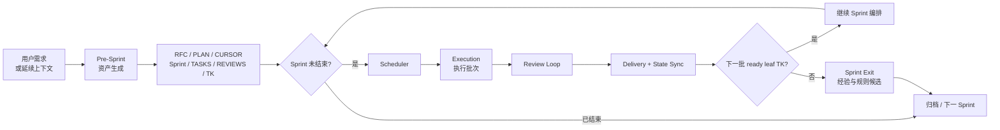
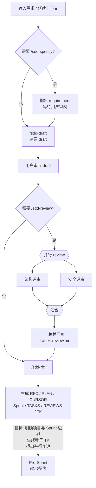
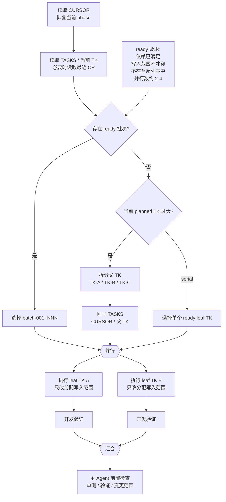
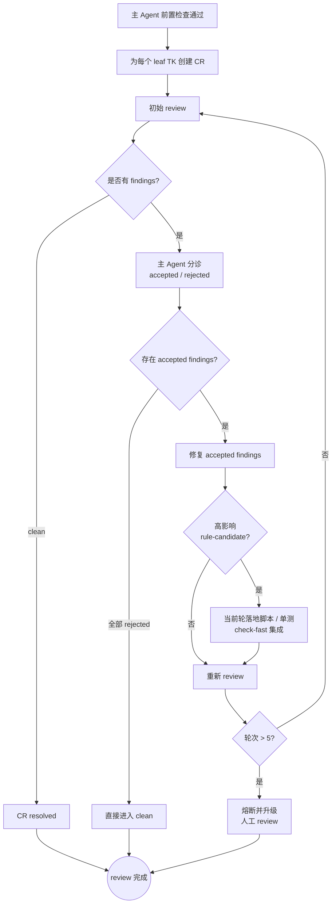
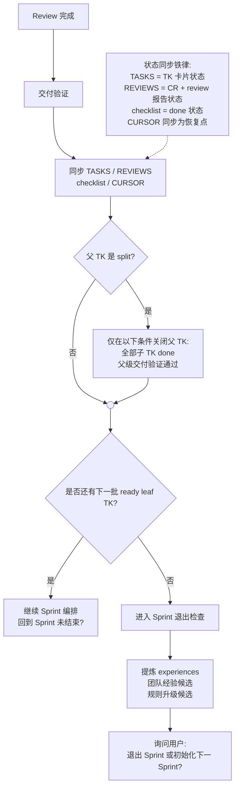

# Wang Agentic Governance SDD Workflow

> Source: `WangSnapshots/my-ai-workflow.jpeg`.
>
> This is an extraction of Wang's framework only. It intentionally does not map the flow to this repo's `protocol.md`.

## What Wang Is

Wang is a sprint-scoped governance loop for agent execution.

The framework is not centered on a single `/sdd-*` command. Those commands create the governance assets. The runtime center is the loop:

```text
Sprint 未结束?
  -> Scheduler
  -> Execution
  -> Review Loop
  -> Delivery + State Sync
  -> 是否还有下一批 ready leaf TK?
      yes -> 继续 Sprint 编排 -> Sprint 未结束?
      no  -> Sprint Exit
```

The key design move is that agents do not continue from memory. They continue from `CURSOR`, `TASKS`, `REVIEWS`, `TK`, `CR`, and checklist state.

## Source Fidelity

The document is mostly faithful to the source diagram. The structural claims below are directly present in `my-ai-workflow.jpeg`:

| Source element                                                                                                             | Document interpretation                                                    |
| -------------------------------------------------------------------------------------------------------------------------- | -------------------------------------------------------------------------- |
| `Sprint 未结束?` sits after `/sdd-rfc` and receives the return arrow from `继续 Sprint 编排`.                              | Sprint execution is a loop, not a one-shot command chain.                  |
| Scheduler reads `CURSOR`, `TASKS`, current `TK`, and recent `CR` before choosing work.                                     | Runtime continuation is file-state driven rather than memory driven.       |
| `ready` batch requires satisfied dependencies, non-conflicting write scopes, not being excluded, and 2-4 concurrent tasks. | Parallelism is controlled by explicit scheduling constraints.              |
| Review creates a `CR` for each leaf `TK`.                                                                                  | Review state is isolated per executable task.                              |
| High-impact `rule-candidate` lands script, unit test, and `check-fast` integration before recheck.                         | Important review lessons become guardrails in the current round.           |
| Delivery syncs `TASKS / REVIEWS / checklist / CURSOR` before deciding next batch or Sprint exit.                           | Completion is a state-accounting step, not just implementation completion. |

Two points in this extraction are intentional interpretations rather than literal labels in the diagram:

1. `CURSOR = resume point` is inferred from the diagram's `读取 CURSOR / 恢复当前 phase` and `同步 ... CURSOR` nodes. The source note's explicit "状态同步铁律" only lists `TASKS`, `REVIEWS`, and `checklist`.
2. "Split re-scheduling" means a split parent must be reflected back into `TASKS / CURSOR / parent TK` before the generated child TKs can proceed through the same scheduler/execution path. It does not mean the system must leave the scheduler and start a separate Sprint loop immediately after every split.

## 1. Control Loop



## 2. Pre-Sprint Asset Builder

Pre-Sprint converts loose intent into assets the scheduler can operate on.



## 3. Scheduler + Execution

Scheduler is the main governance point. It chooses work only when it is ready, bounded, and safe to run.

There are two scheduling modes:

| Mode     | Behavior                                              | When it applies                                                                            |
| -------- | ----------------------------------------------------- | ------------------------------------------------------------------------------------------ |
| `batch`  | Select 2-4 ready leaf `TK`s and run them in parallel. | Tasks are small enough and their write scopes do not conflict.                             |
| `serial` | Select exactly one ready leaf `TK`.                   | The current planned work should not be split further, but should also not be parallelized. |



## 4. Review Loop

Review is not just inspection. It converts review output into explicit decisions.

A high-impact `rule-candidate` is not merely filed into a later backlog. In this loop it means: fix the finding, then immediately turn the lesson into a durable guardrail for the current round: script, unit test, and `check-fast` integration.



## 5. Delivery + State Sync

Delivery closes the accounting. A task is not done just because the implementation and CR are done.



## Mechanisms

| Mechanism                     | What it controls                                                                                                                                        |
| ----------------------------- | ------------------------------------------------------------------------------------------------------------------------------------------------------- |
| Pre-Sprint                    | Turns loose context into schedulable governance assets.                                                                                                 |
| `CURSOR`                      | Makes continuation explicit and resumable.                                                                                                              |
| Scheduler                     | Enforces dependencies, write scopes, exclusion list, and parallelism cap.                                                                               |
| Split re-scheduling           | Splitting is only valid after `TASKS`, `CURSOR`, and the parent `TK` are rewritten; child TKs then proceed through the normal scheduler/execution path. |
| `batch` / `serial` scheduling | Chooses between parallel leaf work and one-at-a-time execution.                                                                                         |
| Pre-check Gate                | A final automated validation before moving from Execution to the Review Loop.                                                                           |
| Leaf `TK`                     | Smallest executable, reviewable, state-synced task card.                                                                                                |
| CR per leaf `TK`              | Keeps review state isolated across parallel work.                                                                                                       |
| Accepted/rejected findings    | Prevents review output from automatically becoming implementation work.                                                                                 |
| Rule candidate                | Converts high-impact review knowledge into current-round automated guardrails.                                                                          |
| State sync law                | Ensures task state, review state, checklist state, and the resumable cursor agree.                                                                      |
| Evolution                     | Extracts cross-project experiences and rule-upgrade candidates during Sprint exit.                                                                      |

## Resolved Decisions

1. `serial` is one-at-a-time scheduling: choose a single ready leaf `TK` and enter execution.
2. High-impact `rule-candidate` findings are immediately hardened into scripts, unit tests, and `check-fast` integration in the current round.
3. `轮次 > 5` is a fixed fuse: stop the automated review/fix loop and escalate to human review.
4. Sprint exit is not only "no more work"; it includes extracting experiences, team candidates, and rule-upgrade candidates, then asking whether to exit the Sprint or initialize the next Sprint.
